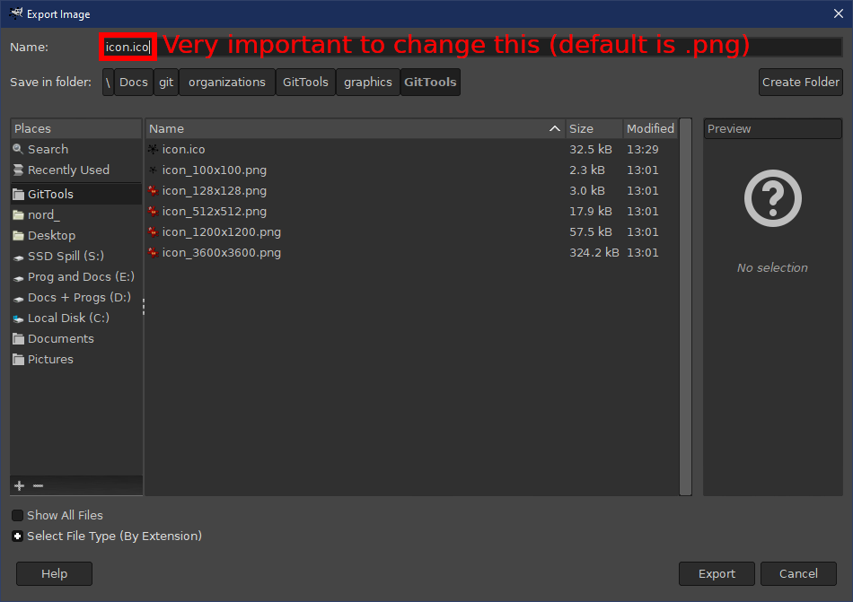

# Creating new `.ico` files

This document will detail the process for creating new icon files with the
file extension `.ico` using [GIMP](https://www.gimp.org/).

## Step 1 (Importing the original image)

The first step is to import the `.svg` file into gimp so it can be used for
creating the new `.ico` file.
Using a `.png` file is also a valid option, but since `.svg` files are usually
scalable vector graphics file that can be scaled to any size without loosing
any textures, we will be using that here.
**NOTE: Once imported to GIMP upscaling the image will result in loss of quality, so only beneficial during initial import.**

1. First install GIMP if you haven't already, then load the program.
2. Load the `.svg` file from `File --> Open` or drag the file into the program.

   
3. You will the be presented with a dialog box where you can set initial Width
   and Height (among other values). The Width and Height should be set to the
   highest size that will be included in the `.ico` file. (At this time, that
   will be 256 for both values).

   

## Step 2 (Defining the different supported sizes)

After you have imported the `.svg` file, you will be presented with a window
showing the imported image. Make a note of the Layer section marked in the
lower right corner.

This section is where we will define all of the sizes that should be inside
the `.ico` file.

1. To start of, we need to duplicate the current Layer as many to several other
   layers (one layer per size). *I recommend to also name the different layers with the size they are meant for. ie `128x128`, `64x64`, etc*. Layers can be renamed easily by double-clicking on the name of the layer (in the previous image, the name is icon.svg).
2. To duplicate a layer, either do any of the following
   - Go to `Layer --> Duplicate Layer`.
   - Right click the current layer and select `Duplicate Layer`
   - Press `Ctrl+Shift+D` (Or equivalent on OSX)
3. After you have duplicated to all the wanted sizes, your layer section should
   look something along the lines of:

   
4. Next comes the tedious part, you will need to go through each and every layer
   and scale the layer to the wanted size.
   This can be done in two ways.
   - Right-click on each layer, then select `Scale Layer...`
   - Or go to the menu `Layer --> Scale Layer...`
5. This will pop up a dialog box where you can select the new Layer size
   of the layer (This **MUST** be done for every layer, except the initial one).

   

## Step 3 (Exporting and saving the `.ico` file)

This is the last step needed, and the one that is the least painful.

1. We must first open the export dialog, which can be done in two ways
   - Go to `File --> Export` (Or Export As)
   - Press `Ctrl+E` (Or `Ctrl+Shift+E` For Export As)
2. This will pop up a save dialog where you can select the name and location
   of where to export the file. Navigate to the folder, and ensure that the Name of the file ends with a `.ico`.

   
3. Now you can press export, but we still ain't done yet.
   Another dialog will pop up, this time the actual Export dialog where you can
   change a few settings for each seperate icon size. (Defaults are typically fine here).

   
4. Change any settings (if any), then press the Export button.
   You are then done, and the new `.ico` file will have been created.
